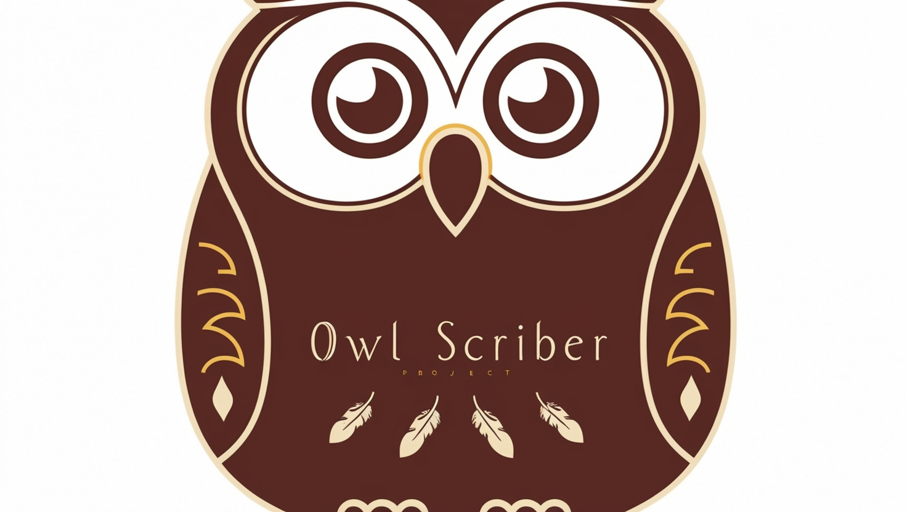
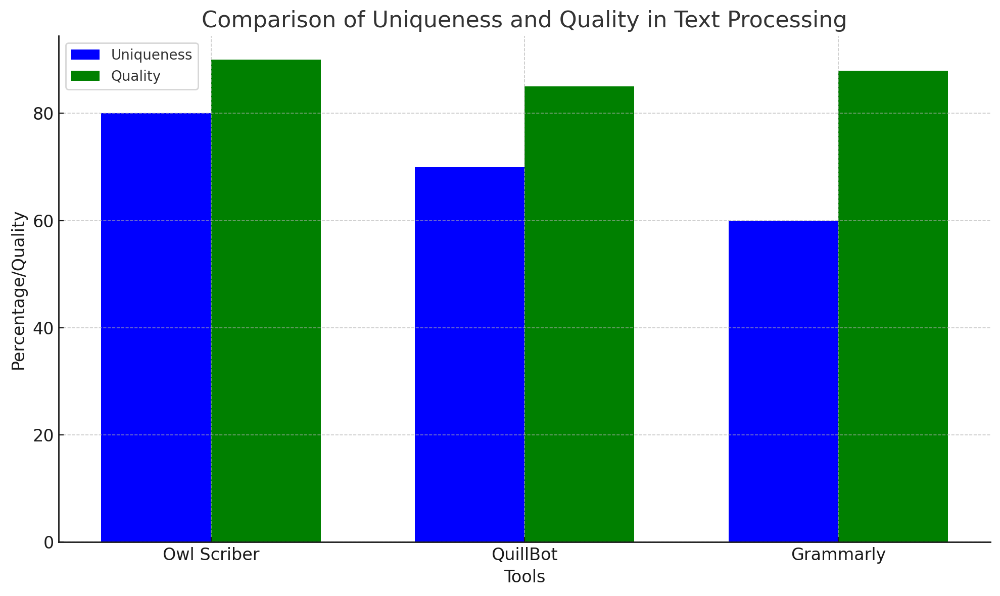

# Owl Scriber - Text Processing App

**Owl Scriber** is a cutting-edge text processing application that aims to simplify the way we work with content. It is designed for anyone who needs to quickly rewrite, paraphrase, or summarize texts. Whether you're a student working on essays, a writer enhancing your articles, or a professional in need of clear and concise content, Owl Scriber provides the perfect solution. 

## Problem it Solves

In today’s fast-paced world, creating high-quality content quickly is essential. However, writing original content or condensing long articles into digestible summaries can be a time-consuming and challenging task. **Owl Scriber** streamlines the content creation process by utilizing AI-driven technology to make text more readable, unique, and concise. 

It helps users:
- **Improve content quality** by paraphrasing text and offering better alternatives.
- **Condense lengthy articles** into shorter, more digestible summaries, making it easier to understand key points.
- **Save time** in rewriting and editing by automating the process.
- **Enhance creativity** by providing multiple options for rewriting content, allowing users to choose the best expression.

## Features

- **Paraphrasing**: Effortlessly rewrite content to make it more engaging and unique.
- **Summarization**: Automatically condense long texts into clear and concise summaries, perfect for quick reads.
- **Text Analysis**: Analyze and refine your text to enhance readability and engagement.
- **State-of-the-art AI**: Powered by advanced AI technology, Owl Scriber delivers highly accurate and context-aware results.
- **User-friendly Interface**: The clean, intuitive design makes it easy for anyone to use without prior experience.
- **Chrome Extension**: For quick access, you can also use Owl Scriber directly from your browser with the Chrome extension.

## Comparison Graph

Below is a comparison of the results from **Grammarly**, **QuillBot**, and **Owl Scriber** on a sample text, demonstrating how each tool performs in terms of output quality, processing time, and text uniqueness.

### How to Generate the Comparison Graph:
To generate the graph for comparing the results of different text processors, follow these steps:

1. Collect output data from **Grammarly**, **QuillBot**, and **Owl Scriber** using the same input text.
2. Create a graph using tools like **Google Sheets**, **Python Matplotlib**, or any other data visualization tool to plot the comparison.
3. Upload the resulting graph image in the designated space.

## Conclusion

Owl Scriber is a powerful text processing tool designed to help individuals and professionals create high-quality, unique, and concise content quickly. Whether you're paraphrasing, summarizing, or enhancing your writing, Owl Scriber will be your go-to solution for text enhancement.

---
*Note: The graph above compares the output of different text-processing tools. Replace the placeholder with your graph for a visual comparison.*
